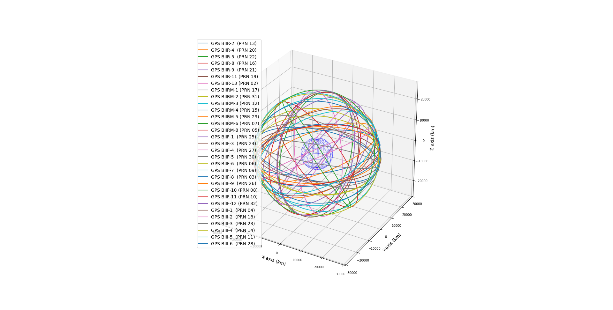

# sat-plots

## Setup

Tested on Fedora 40 using Python 3.12.

`pip install -r requirements.txt`

## Usage

### Fetch Data

`python fetch.py <constellation>`

`constellation` must be one of `intelsat`, `iridium`, `starlink`, `oneweb`, `gps-ops`, `glo-ops`, `galileo`, or `beidou`.

Data is fetched from [celestrak.org](https://celestrak.org/).

### Plot Orbits

`python plot.py <constellation>`

`constellation` must be one of `intelsat`, `iridium`, `starlink`, `oneweb`, `gps-ops`, `glo-ops`, `galileo`, or `beidou`.

Note: You must first fetch the data for your chosen satellite constellation.

